Devin Puckett

CST-250 Programming in C#2

Grand Canyon University

10/27/2025

Milestone 3

[https://github.com/devinpuckett4/CST-250-Milestone3/blob/main/Milestone3.md]

https://www.loom.com/share/2c82238f224449009ef10b504f53dbbd

 
FLOW CHART

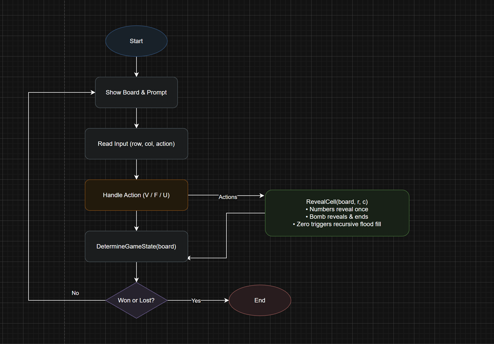
 
Figure 1: Flow chart of Milestone 3

I start the game, draw the board, and give a short prompt. I read a move with row, column, and an action. The action step does the work. Reveal opens the cell, flags add or remove a marker, and unflag clears one. Reveal follows the game rules. Numbers open once and stay visible, hitting a bomb ends the run, and a zero kicks off flood fill to open the empty region and stop when it reaches numbered cells. After the action I evaluate the board to see if the player has won or lost. When the game is over, I end. If not, I loop right back to show the updated board and ask for the next move.

UML Class Diagram

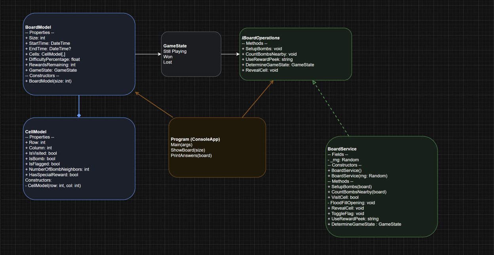

Figure 2: UML Class Diagram

BoardModel holds the grid, timing, difficulty, rewards left, and overall game state, while each CellModel tracks its location, bomb status, flags, visit state, neighbor count, and any reward. GameState is a simple value for still playing or lost. BoardService is the brain that sets bombs, counts neighbors, reveals cells including flood fill, handles flags, and decides the state, following the IBoardOperations contract. Program is the console entry point that spins everything up and prints what I need. In short, Program calls BoardService, BoardService updates the board and cells, and the game runs until the state says stop.

Low Fidelity

 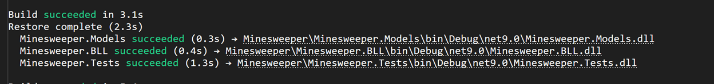
 
Figure 3: Screenshot of Build Success

This screenshot shows that my Minesweeper solution builds successfully in Visual Studio. The Models, BLL, and Tests projects all compile with zero errors. This is important because it proves my updated code for the recursive flood fill still works with the entire project structure. It also helps confirm that my solution is ready to run and submit. Completing a clean build is one of the steps in the milestone instructions.

High Fidelity

Figure 4: High Fidelity

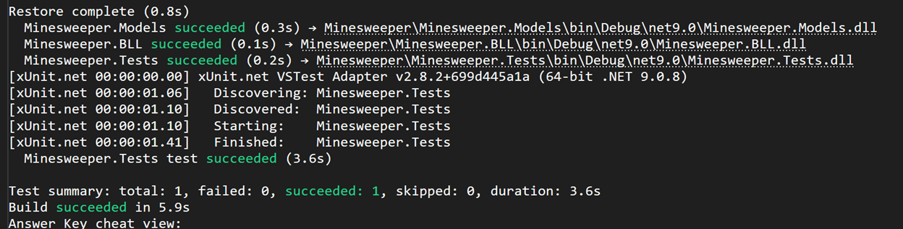

This screenshot shows the results from running xUnit tests on my logic layer. The test summary confirms one test passed with zero failures, so everything I implemented behaves correctly according to the test design. Passing the tests is also part of proving I implemented the recursive behavior properly. It also shows that my business logic is tested separately from the UI, which demonstrates object-oriented design. This gives more confidence that the game is working as expected.

 
 
Figure 5: Screenshot of Fresh Board

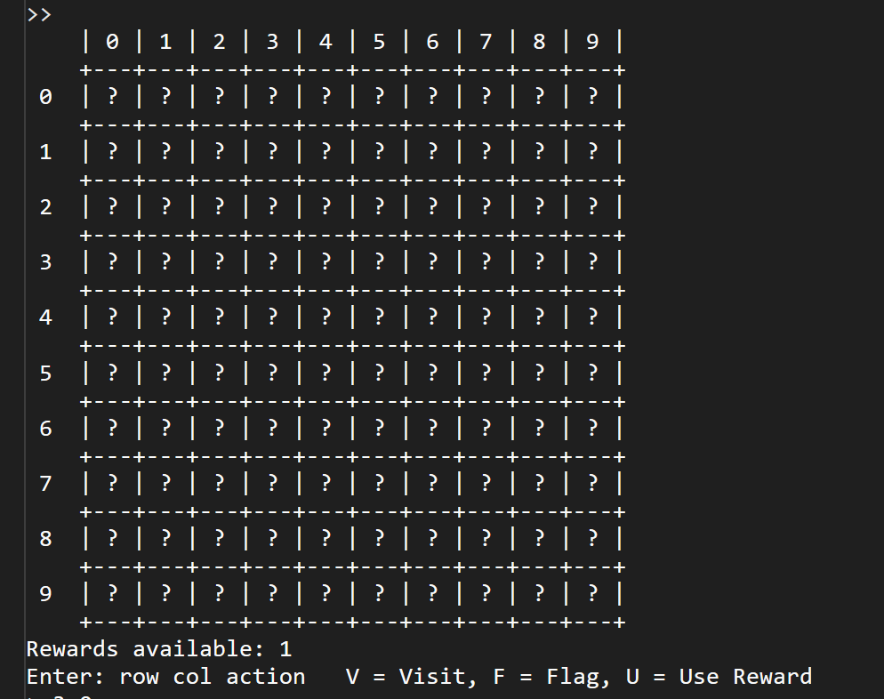

This image shows the beginning of a brand-new round before any moves have been made. All the cells are still hidden and marked with a question mark so I can’t tell yet where bombs are located. This display proves that the board resets correctly and hides everything until a move is made. You can also see the reward counter ready to use later in the game. This screenshot makes it clear what the board looks like in its default state before the player interacts with it.

Figure 6: Screenshot of Fill

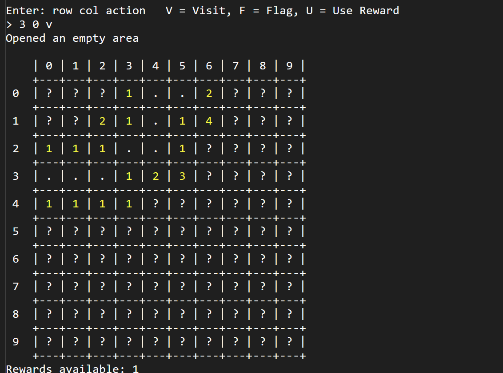

Here, I visited a cell that had zero bomb neighbors, which triggered the new recursive flood fill feature. Instead of me having to click every empty cell one at a time, the game automatically opened a big area and stopped at the numbered borders. This shows how the recursion works by revealing all safe connected spaces. The console even says “Opened an empty area,” confirming the logic worked as expected. This is one of the main goals of Milestone 3, so this screenshot is a key demonstration.

Figure 7: Screenshot of Additional Fill

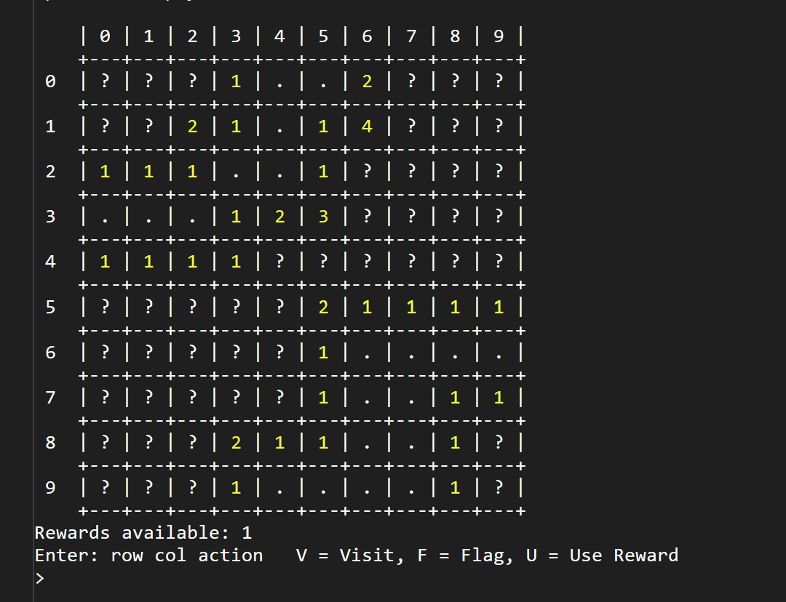

This screenshot shows the board after several safe cells have been revealed while still keeping hidden areas closed. The numbers clearly mark how many bombs are near each revealed cell, helping the player decide their next move. It shows the game running normally after flood fill has already triggered once. This helps prove that the recursive logic doesn’t break anything else during gameplay. It also shows steady progress while still protecting the hidden spaces that might hold bombs.

Figure 8: Screenshot of Visit After Fill

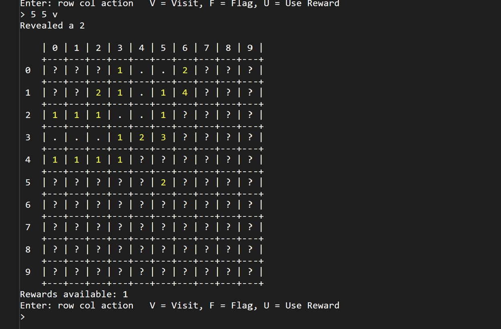

I visited a safe cell here to show the reveal behavior. Numbers appear where the cell touches bombs and dots show empty space. That feedback is what I use to decide my next move instead of guessing. It’s a quick way to prove the reveal logic works.

Figure 9: Screenshot of Game Lost

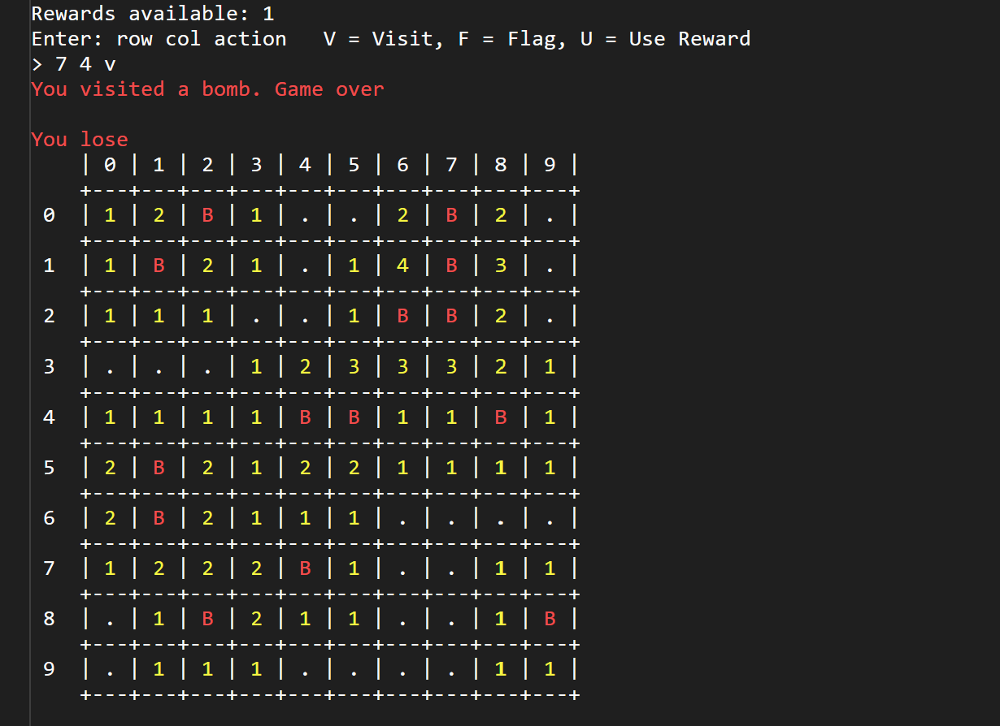

In this screenshot, I accidentally selected a cell that contained a bomb, which immediately ended the game. The console prints a clear message saying “You visited a bomb. Game over,” and then the board is fully revealed to show every bomb and number. This final reveal lets me confirm where the bombs were hidden and how close I was to clearing the board. You can see several bombs marked with a red “B” while the surrounding numbers show how many bombs were in each area. Even though I lost, it shows that the game rules worked correctly. This also demonstrates part of the Milestone requirement: correct loss detection and revealing the full answer key. 

Figure 10: Screenshot of Error Handling
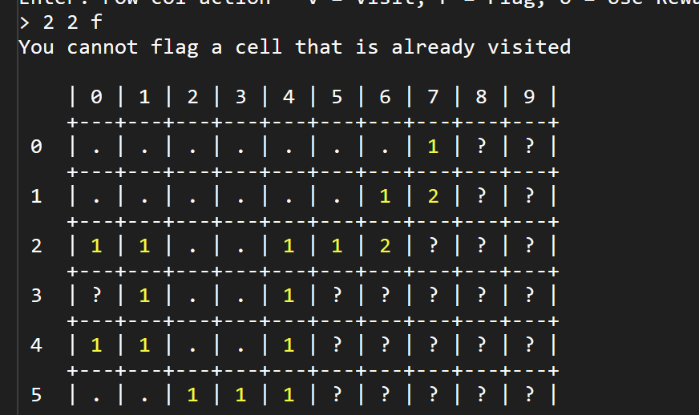

In this example, I tried to place a flag on a cell that was already revealed, and the game blocked me from doing it. The message “You cannot flag a cell that is already visited” appears to prevent mistakes. This confirms that my program checks for valid user actions and doesn’t allow something that would break the game logic. It also proves flagging only works on hidden cells, just like in real Minesweeper. That’s part of the milestone expectations for correct gameplay rules.

---
Use Case Scenario
---

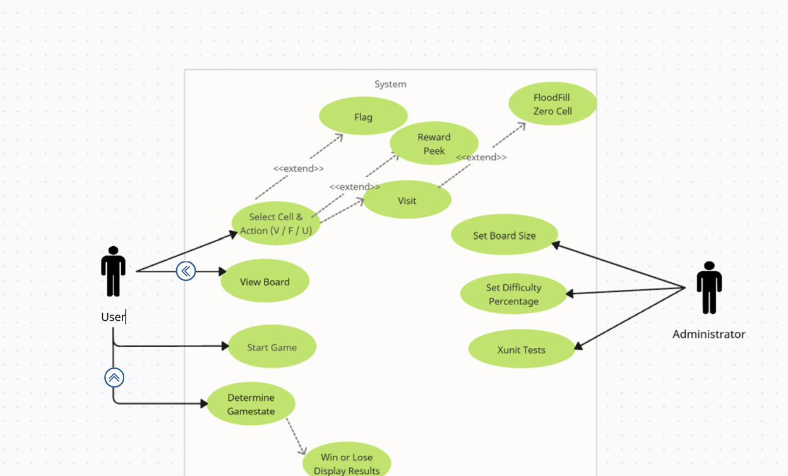

This diagram shows how the player and the administrator interact with the Minesweeper system. On the left, the user can start a game, view the board, and select a cell and action V, F, or U. Those actions allow the user to visit a cell, place a flag, or use the reward peek feature. When a user visits a cell with zero bomb neighbors, the system automatically performs the flood fill zero cell action to reveal a connected safe area and stop at any numbered edge. After each move, the system determines the game state, and if the user has won or lost, it displays the results. On the right, the administrator is responsible for setting the board size, adjusting the difficulty percentage, and running xUnit tests. These settings help configure and verify the game but are not part of normal gameplay. Overall, the diagram clearly separates the actions the user performs during gameplay from the internal logic the system handles, as well as from the administrative setup controls.

ADD ON — Milestone 3

Programming Conventions

1.	Keep files grouped by what they do. Models hold the data, BLL handles the game rules, and the ConsoleApp shows the board and reads input.

2.	Name things clearly and add small comments so future me knows what a method is for.

3.	The BLL is the brain. The models are storage. The UI only prints and reads from the player.

4.	Keep methods focused on one job. RevealCell now handles regular visits and calls flood fill when needed. Other methods include SetupBombs, CountBombsNearby, ToggleFlag, UseRewardPeek, and DetermineGameState.

5.	Check for out-of-bounds or bad input first, then always guide the player with a friendly message.
________________________________________

Computer Specs

• Windows 10 or Windows 11

• Visual Studio 2022

• .NET SDK installed

• 8 GB RAM or more

• Git and GitHub account

________________________________________

Work Log  Milestone 3

Wednesday - Discussion Day

• Posted about recursion and why flood fill works well for zero cells

Total: 40m

Friday

• 6:15–7:30 PM - Added the new RevealCell logic and recursive flood fill

• 7:40–8:30 PM - Updated the console messages for open areas and numbers

Total: 1h 45m

Saturday

• 10:00–11:15 AM - Updated UML and use-case diagram to show flood fill

• 11:30–12:40 PM - Wrote three xUnit tests for flood fill, numbers, and bombs

Total: 2h 25m

Sunday - Discussion Day

• 1:00–1:35 PM - Discussion replies about recursion vs iteration

Total: 35m

Monday

• 5:20–6:45 PM - Cleaned comments, retook screenshots, fixed alignment in console

• 7:00–7:40 PM - Reviewed build and final test run with passes

Total: 2h 05m

Grand Total: 7h 30m
________________________________________
What I added

• A recursive flood fill that reveals empty areas automatically

• Updated RevealCell so it now calls flood fill only when needed

• New xUnit tests that check zero expansion, number-only reveal, and bomb reveal

• Updated UML and use-case diagram to include flood fill as an extended behavior

• Better display messages for empty areas vs numbered cells

OOP principles I used

• Abstraction -The interface describes what the board service can do

• Encapsulation - Data stays in the board and cell classes and the BLL changes it

• Polymorphism - The flood fill uses recursion to repeat the same action on neighbors

• Separation of concerns - UI, rules, and data remain cleanly separated

Tests
• Three new tests passed: zero expansion, number reveal, and instant loss on bomb
________________________________________

Bug Report

• Forgot to block flood fill when a bomb was clicked, fixed

• One test failed at first because a neighbor edge was not counted right, fixed

• Console spacing needed a small adjustment after flood fill revealed many cells

________________________________________
Follow-Up Questions
1.	What was tough?
Getting the recursion right so it would not overflow and did not flip a bomb by accident. Also making sure numbers stop the spread at the right time.
2.	What did I learn?
Recursion is strong when the problem repeats in a pattern. I also learned that small tests help me catch mistakes fast without guessing.
3.	How would I improve it?
A simple menu to choose board size and difficulty before the game. More tests about peeking rewards and corner expansions. Later, a click-based GUI.
4.	How does this help at work?
Breaking the project into layers makes everything easier to update and test later. Recursion also shows another way to solve problems without big loops.
